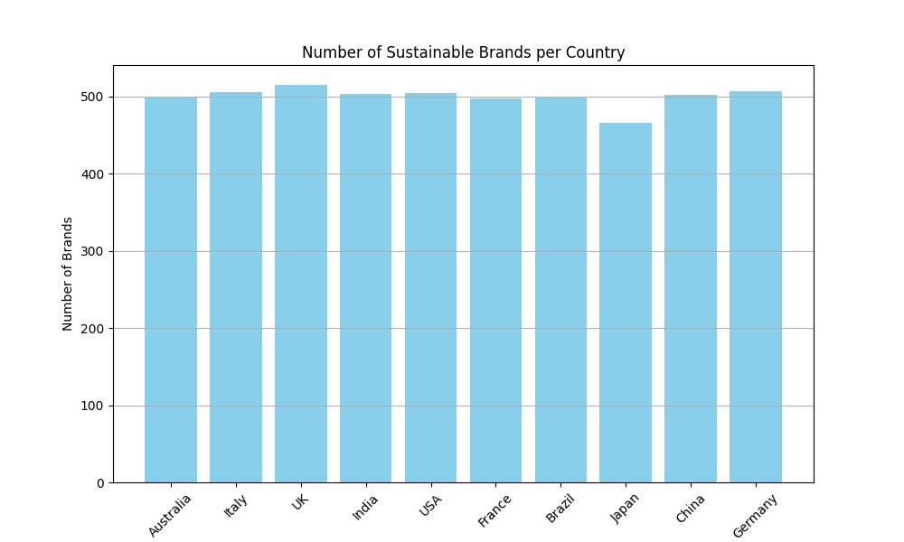

# IDS 706 Week 3 Mini Project - Polars Descriptive Statistics Script

### 📂 Project Structure
.
├── .devcontainer
│   ├── Dockerfile
│   └── devcontainer.json
├── .github
│   └── cicd.yml
├── .gitignore
├── Makefile
├── README.md
├── bar_plot.png
├── mylib
│   ├── __pycache__
│   │   └── make_functions.cpython-312.pyc
│   └── make_functions.py
├── pandas_main.py
├── pie_chart.png
├── requirements.txt
├── sustainable_fashion.md
├── sustainable_fashion.py
├── sustainable_fashion_trends_2024.csv
└── test_main.py

### 🏗️ Requirements
- Python script using Polars for descriptive statistics
- Read a dataset (CSV or Excel)
- Generate summary statistics (mean, median, standard deviation)
- Create at least one data visualization

### 📂 Contents of this repository
- .devcontainer
- README.md
- Makefile
- .github/workflows
- requirements.txt
- sustainable_fashion.md

### 📊 Dataset Description
The dataset used for this project is Sustainable Fashion: Eco-Friendly Trends from Kaggle. It provides information on sustainable fashion trends with various metrics related to the industry. For more details and to download the dataset, visit this [link](https://www.kaggle.com/datasets/waqi786/sustainable-fashion-eco-friendly-trends).

The dataset has the following features:
- Brand_ID
- Brand Name
- Country - country of origin
- Year - year the brand was created
- Sustainability_Rating - the rating of the brand - from A to D
- Material_type - the type of materials used
- Eco_Friendly_Materials - whether the materials were eco-friendly or not
- Carbon_Footprint_MT - the carbon footprint generated in metric tonnes
- Water_Usage_Liters - the amount of water used in liters
- Waste_Production_KG - the amount of waste produced in kilograms
- Recycling_Programs - whether the brand had any recycling programs or not
- Product_lines - number of product lines the brand had
- Average_Price_USD - the average price of a product by the brand, in US Dollars
- Market_Trend - checking the place of these brands as per the market
- Certifications - any certifications the brand had

### 🚀 How to Run
1. Clone the repository:

```bash
git clone https://github.com/nogibjj/Nruta_Mini_Project_2.git
cd Nruta_Mini_Project_2
```

2. Install the required dependencies:

```bash
pip install -r requirements.txt
```

3. Run the script:

```bash
python sustainable_fashion.py
```

4. Generate Markdown and visualizations:

- The output summary statistics will be saved in `sustainable_fashion.md`.
- Visualizations (bar chart and pie chart) will be saved as `bar_plot.png` and `pie_chart.png`.

### 🧪 Testing
You can run the script and test the output with the dataset provided. To check the correctness of the statistics and visualizations, run:

```bash
make test
```

### 📊 Output
After running the script, you will see:

- Summary statistics for numerical columns (mean, median, std deviation).
- Bar chart and pie chart visualizations saved in the root folder.

### 📋 Summary Statistics 

Describe:
|    | Statistic          |   Value |
|---:|:-------------------|--------:|
|  0 | Mean               | 250.318 |
|  1 | Median             | 250.65  |
|  2 | Standard Deviation | 142.802 |

### 🔍 Visualizations
The script generates two visualizations:

1. Bar Chart - Displays the number of sustainable fashion brands by the countries.


2. Pie Chart - Shows the propotion of brands based on the materials they use.


The statistics and the visualizations for the Sustainability brands data can also be viewed through the following link:
[Click here to view details](sustainable_fashion.md)

### Extra Credit (Profile benchmark for Pandas vs Polars)
[!Time comparison](Time%20comparison%20ss.png)
While Polars is generally known for its speed advantages over Pandas, our execution results suggest otherwise in this specific case. Upon further inspection, it appears that some functions are more optimized in Pandas than in Polars.

For instance, rendering visualizations using Matplotlib is straightforward with a Pandas DataFrame. However, with Polars, we need to convert the DataFrame to a NumPy array before passing it to the visualization function. This additional step may contribute to longer execution times when working with Polars in this context.